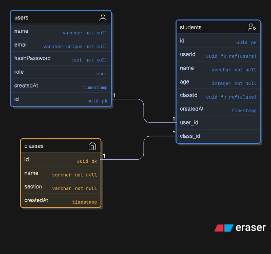

<p align="center">
  <a href="http://nestjs.com/" target="blank">
    
  </a>
</p>

<h2 align="center">📘 School Management API</h2>

<p align="center">
  A modular <a href="http://nodejs.org" target="_blank">Node.js</a> REST API built with <a href="http://nestjs.com/">NestJS</a>, 
  <a href="https://orm.drizzle.team/">Drizzle ORM</a>, and <a href="https://www.postgresql.org/">PostgreSQL</a>.
</p>

<p align="center">
  <a href="https://www.npmjs.com/package/@nestjs/core" target="_blank"></a>
  <a href="https://www.npmjs.com/package/@nestjs/core" target="_blank"></a>
  <a href="https://discord.gg/G7Qnnhy" target="_blank"></a>
  <a href="https://twitter.com/nestframework" target="_blank"></a>
</p>

---

## 📖 Description

This project implements a **Mini School Management API** with:

- ✅ **Authentication & Authorization** using JWT + role-based guards (`admin`, `teacher`, `student`)
- ✅ **Students & Classes Management** with enrollments
- ✅ **PostgreSQL + Drizzle ORM** for schema & migrations
- ✅ **Validation** using `class-validator` DTOs
- ✅ **Secure Cookies** for access/refresh tokens
- ✅ **Optional Docker setup** for database

---

## 🚀 Getting Started

### 1. Clone & Install

```bash
git clone https://github.com/<your-repo>/school-management-api.git
cd school-management-api
pnpm install
```

### 2. Run Database (Postgres with Docker)

```bash
docker compose up -d
```

### 3. Database Management (Drizzle ORM)

Generate schema & migrations:

```bash
pnpm drizzle-kit generate
pnpm drizzle-kit migrate
pnpm drizzle-kit studio
```

Seed database with dummy data:

```bash
pnpm run db:seed
```

### 4. Start Server

```bash
# development
pnpm run start:dev

# production
pnpm run start:prod
```

API will be available at:
👉 `http://localhost:3000/api`

---

## 🏗️ Database

### ER Diagram



- `users` – Authentication + roles (admin, teacher, student)
- `students` – Student records
- `classes` – Class records

---

## ⚡ API Endpoints (Highlights)

### Auth Module

- `POST /auth/signup` – Register user (admin/teacher/student)
- `POST /auth/login` – Login and receive JWT tokens
- `POST /auth/refresh` – Refresh access token
- `POST /auth/logout` – Logout and clear cookies
- `GET /auth/me` – Get logged-in user

### Student Module

- `POST /students` – Create student (admin only)
- `GET /students` – List students (admin/teacher)
- `GET /students/:id` – Get student details

### Class Module

- `POST /classes` – Create class (admin only)
- `POST /classes/:id/enroll` – Enroll student in class (admin/teacher)
- `GET /classes/:id/students` – List students in a class (admin/teacher)

---

## 🔒 Authentication & Security

- **JWT Access Token** (15 min expiry) stored in `httpOnly` cookie
- **Refresh Token** (7 days expiry) stored in `httpOnly` cookie
- **Role-based guards** restrict endpoints to `admin`, `teacher`, or `student`
- **Password hashing** with bcrypt (saltRounds = 10)

---

## 🛠️ Development Tools

### Generate Module/Resource (no tests)

```bash
nest g res <module_name> --no-spec
```

Example:

```bash
nest g res auth --no-spec
```

### 🧪 API Testing

- Download and import the [Postman Collection](./Mini%20School%20Management%20API.postman_collection.json) to try out all endpoints quickly.
- Make sure to set the `baseUrl` environment variable in Postman to `http://localhost:3000/api` (or your deployed [URL](https://school-management-apis.vercel.app/)).
- Auth endpoints require no token, but most others require a valid JWT (see Auth section above).

### 📖 API Documentation

- Interactive Swagger UI available at: [http://localhost:3000/api/docs](http://localhost:3000/api/docs)
- Explore all endpoints, schemas, and try requests directly from the browser.

---

## 📚 Resources

- [NestJS Docs](https://docs.nestjs.com)
- [Drizzle ORM Docs](https://orm.drizzle.team/)
- [PostgreSQL Docs](https://www.postgresql.org/docs/)

---

## 📜 License

This project is [MIT licensed](./LICENSE).
